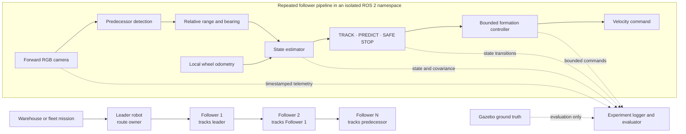
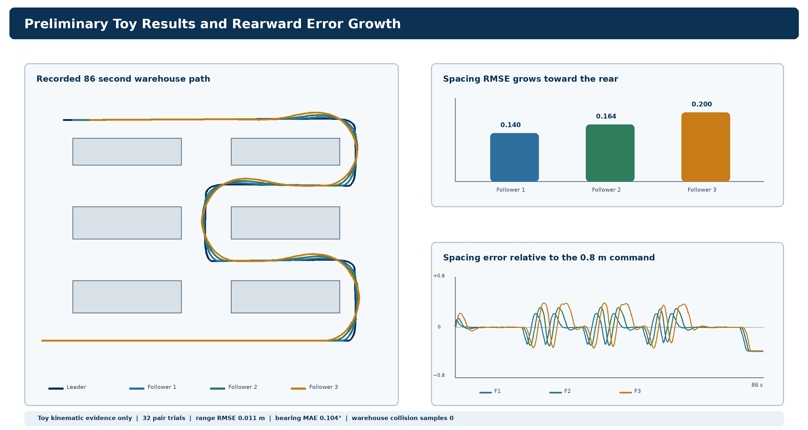

# Vision Only Leader Follower Warehouse Coordination

[](https://github.com/justneeraj12/ee616-vision-leader-follower/actions/workflows/ci.yml)
[](work/toy_simulation/pyproject.toml)
[](docs/PROJECT_STATUS.md)
[](docs/PROJECT_STATUS.md)
[](docs/PROJECT_STATUS.md)
[](https://www.clarkson.edu/)

A reproducible research project for camera-only predecessor following in a flexible warehouse material-delivery convoy.

The leader owns the route. Each independently driven follower observes the robot immediately ahead through a forward RGB camera, combines the relative visual measurement with local wheel odometry, and uses bounded control to maintain a commanded gap. The planned implementation targets ROS 2 Jazzy and Gazebo Harmonic on constrained laptop hardware.

> **Current status:** deterministic two-dimensional toy baseline and containerized ROS 2/Gazebo environment gate complete.
>
> ROS 2 namespace and Gazebo camera transport smoke tests now pass. No camera-accuracy, follower-control, physical-robot, or production-safety result has been demonstrated.

## Research objective

The primary research question is:

> How accurately and reliably can a resource-constrained follower robot maintain leader-relative formation using a forward RGB camera and local odometry under changes in range, heading, velocity, turns, and short visual occlusions?

The minimum scientific unit is one leader and one follower. Additional followers will be introduced one at a time only after the pair is validated. This ordering makes perception error, estimator behavior, closed-loop control, and rearward error propagation independently measurable.

## Why this project

Warehouse and manufacturing operations repeatedly move parts, picked goods, containers, and work-in-process inventory along common routes. The proposed convoy studies whether independently driven carts can reproduce a predecessor's motion without mechanically coupling every load or assigning full route planning to every follower.

The project combines:

- monocular camera geometry and target detection;
- relative-state estimation through short measurement gaps;
- bounded range-and-bearing control;
- explicit `TRACK`, `PREDICT`, and `SAFE STOP` behavior;
- isolated ROS 2 namespaces for repeated follower instances;
- synchronized experiment logging and evaluation-only ground truth;
- incremental multi-follower validation;
- timing and resource measurements on constrained hardware.

## Verified evidence

| Evidence | Verified result | Boundary |
|---|---:|---|
| Automated tests | 7 passing | Toy Python implementation only |
| Single-pair experiment | 32 deterministic trials | Four scenarios and eight recorded seeds |
| Synthetic range measurement | 0.011 m median RMSE | Direct camera-like geometry, not image detection |
| Synthetic bearing measurement | 0.104° median MAE | Idealized pinhole model with pixel noise |
| Single-pair formation error | 0.009 m median RMSE | Kinematic model with ideal follower pose |
| Forced-occlusion reacquisition | 0.030 s median | Declared deterministic occlusion window |
| Warehouse demonstration | 86 simulated seconds | One leader and three followers |
| Warehouse route | 7 completed route segments | Six-shelf two-dimensional maze |
| ROS workspace | 2 packages built; 2 tests passed | Environment infrastructure only |
| Namespace smoke test | `/leader` and `/follower_1` passed | Five local heartbeat samples per namespace |
| Gazebo camera transport | 15 timestamped 640×480 RGB samples | Transport check; not range/bearing accuracy |
| NVIDIA container access | RTX 3050 Ti, 4 GB VRAM visible | Passthrough verified; acceleration not benchmarked |
| Warehouse collision record | 0 toy collision samples | Center/radius model; not a safety result |
| Follower spacing RMSE | 0.140, 0.164, 0.200 m | Error increases toward the rear |

The machine-readable sources for these values are committed under [`work/toy_simulation/results`](work/toy_simulation/results) and [`work/toy_simulation/warehouse_results`](work/toy_simulation/warehouse_results).

## System architecture



Gazebo ground truth may be logged for evaluation, but it must never enter detection, estimation, supervision, or control. Each robot will use the same follower interfaces under a separate namespace.

## Camera measurement model

The toy baseline uses a pinhole-camera relationship with a known target height:

- range estimate: `r = f × H / h`
- bearing estimate: `θ = atan((u - cx) / f)`

Here `f` is focal length in pixels, `H` is known target height, `h` is detected bounding-box height, `u` is the horizontal box center, and `cx` is the camera principal point. The Gazebo measurement gate must test how this estimate changes with distance, off-axis placement, target heading, lighting, partial visibility, image resolution, and motion.

## Supervisory behavior

| State | Entry condition | Allowed behavior |
|---|---|---|
| `TRACK` | A recent valid measurement is available | Update the estimate and apply bounded control |
| `PREDICT` | Detection is temporarily unavailable | Predict for no longer than the configured timeout |
| `SAFE STOP` | The estimate is unavailable or stale | Command zero linear and angular velocity |

These states define deterministic research behavior. They do not establish certified braking distance or person safety.

## Preliminary warehouse demonstration



[Download the multi-follower warehouse demonstration video](deliverables/Neeraj_Kanchani_EE616_Multi_Follower_Warehouse_2D.mp4)

The video shows one leader and three independently controlled followers moving through a six-shelf maze. It is a two-dimensional kinematic demonstration intended to explain topology, logging, and presentation. It is not a Gazebo or physical-robot result.

## Validation roadmap

| Gate | Scope | Status |
|---:|---|---|
| 1 | ROS 2 Jazzy and Gazebo Harmonic environment and reproducibility validation | Complete |
| 2 | Camera-only range and bearing measurements against evaluation ground truth | Not started |
| 3 | One leader and one follower with estimator, bounded controller, and recovery states | Not started |
| 4 | Followers added incrementally with error-propagation measurements | Not started |
| 5 | Turns, occlusions, stopped leaders, and controlled disturbances | Not started |
| 6 | Resource and inference benchmarks on the target laptop | Not started |
| 7 | Frozen experiments, final video, report, and submission package | Not started |

The validated pair is the minimum result. One leader and three followers remain the target demonstration only if the pair and incremental-chain evidence pass.

## Containerized ROS 2 and Gazebo foundation

The approved ROS 2 implementation is organized under `work/ros2_ws/`. An official ROS 2 Jazzy Ubuntu Noble image provides the canonical environment, with Gazebo Harmonic installed through the supported `ros_gz` packages.

```bash
make container-config
make container-build
make environment-check
```

The foundation passed on the target laptop with ROS 2 Jazzy, Gazebo Sim 8.15.0, two isolated namespaces, and timestamped camera transport. The optional NVIDIA profile sees the RTX 3050 Ti and 4 GB VRAM. These are environment results only, not camera-accuracy or follower-performance evidence.

See [the environment setup](docs/ENVIRONMENT_SETUP.md) and [system architecture](docs/SYSTEM_ARCHITECTURE.md) for host prerequisites, GPU configuration, robot roles, and evidence boundaries.

For interactive development, open the repository in VS Code and select **Dev Containers: Reopen in Container**. Then run the `EE616: Start simulation workspace` task to build the ROS workspace, open the Gazebo warehouse playground, and start a separate ROS learning shell. See the [developer workflow](docs/DEVELOPER_WORKFLOW.md), [project learning maps](docs/LEARNING_MAPS.md), and [metrics guide](docs/METRICS_GUIDE.md).

## Quickstart

Clone the private repository and create a Python environment:

```bash
git clone https://github.com/justneeraj12/ee616-vision-leader-follower.git
cd ee616-vision-leader-follower/work/toy_simulation
python3 -m venv .venv
source .venv/bin/activate
python -m pip install --upgrade pip
python -m pip install -e .
```

Run the automated tests:

```bash
python -m unittest discover -s tests -v
```

Regenerate the single-pair baseline:

```bash
python -m toy_swarm.run --output results
```

Regenerate the warehouse experiment:

```bash
python run_warehouse.py
```

The commands write machine-readable summaries, time series, and figures beneath `work/toy_simulation/`. Passing the toy tests does not validate the later ROS 2 or Gazebo system.

## Repository layout

```text
.
├── .github/workflows/         Continuous integration
├── deliverables/              Review reports, videos, and packaged baselines
├── docs/                      Status, decisions, and implementation approvals
├── references/                Original supplied project context
├── work/
│   ├── industry_application_report/
│   ├── professor_package/
│   ├── technical_explanation_report/
│   └── toy_simulation/
│       ├── src/toy_swarm/     Simulator, measurement, filter, control, and plots
│       ├── tests/             Automated toy-baseline tests
│       ├── results/           Single-pair evidence
│       └── warehouse_results/ Multi-follower evidence
├── PROJECT_MASTER_PROMPT.md   Standing project and evidence rules
├── CONTRIBUTING.md            Contribution and approval workflow
├── CHANGELOG.md               Reviewable project milestones
└── CITATION.cff               Repository citation metadata
```

The `work/` placement is intentional. Project source, report builders, datasets, and internal quality checks remain separate from review-ready files in `deliverables/`.

## Reproducibility and research integrity

- Random seeds and experiment configurations are recorded.
- Tests reject non-finite outputs and check deterministic behavior.
- Measured results, proposed targets, and planned work are labeled separately.
- Ground truth is restricted to logging and evaluation in the planned simulator.
- Follower namespaces must remain isolated as the chain grows.
- Reported values must be traceable to committed JSON or CSV evidence.
- A failed or incomplete experiment will be reported rather than replaced with an unsupported claim.
- New implementation gates require approval before code, dependency, or architecture changes begin.

## Target hardware

Development targets an MSI Katana GF66 12UD with:

- Intel Core i5-12450H;
- 16 GB RAM;
- NVIDIA RTX 3050 Ti Laptop GPU with 4 GB VRAM;
- Ubuntu 24.04.

The project will establish an ordinary FP32 inference baseline before considering FP16. INT8 will be considered only if calibration evidence shows acceptable accuracy loss. Gazebo rendering and inference share the same limited GPU memory, so peak VRAM and dropped frames must be measured.

## Scope boundaries

In scope:

- forward RGB perception for formation coordination;
- local wheel odometry;
- relative range and bearing estimation;
- Kalman filtering or EKF-based state estimation;
- bounded follower control and recovery states;
- ROS 2 Jazzy and Gazebo Harmonic experiments;
- incremental predecessor-following chains;
- timing, accuracy, recovery, and resource measurements.

Out of scope unless the project is explicitly changed:

- LiDAR or stereo fusion in the formation layer;
- global mapping or route planning on every follower;
- claims that the exact camera-only convoy is already a standard commercial system;
- physical-robot or warehouse-deployment validation during the current evidence stage;
- claims that simulation proves production safety or certification.

## Safety boundary

Vision-based formation coordination is separate from industrial robot safety. A deployment would still require independent safety-rated person and obstacle detection, emergency stops, verified stopping distances, speed and zone supervision, communications supervision, warnings, cybersecurity, site risk assessment, commissioning, and applicable standards compliance.

This repository does not claim that the current toy model satisfies those requirements.

## Faculty review materials

| Deliverable | Purpose |
|---|---|
| [Initial technical explanation and preliminary figures PDF](deliverables/Neeraj_Kanchani_EE616_Initial_Technical_Explanation_and_Preliminary_Figures.pdf) | Primary current faculty-review report |
| [Editable technical explanation DOCX](deliverables/Neeraj_Kanchani_EE616_Initial_Technical_Explanation_and_Preliminary_Figures.docx) | Editable report source |
| [Industry application and system rationale PDF](deliverables/Neeraj_Kanchani_EE616_Industry_Application_and_System_Rationale.pdf) | Application, roles, and safety boundary |
| [Initial toy simulation results PDF](deliverables/Neeraj_Kanchani_EE616_Initial_Toy_Simulation_Results.pdf) | Single-pair preliminary evidence |
| [Warehouse demonstration video](deliverables/Neeraj_Kanchani_EE616_Multi_Follower_Warehouse_2D.mp4) | Preliminary multi-follower visualization |

## Documentation

| Topic | Document |
|---|---|
| Current evidence, blockers, and next gate | [docs/PROJECT_STATUS.md](docs/PROJECT_STATUS.md) |
| Technical and scope decisions | [docs/DECISION_LOG.md](docs/DECISION_LOG.md) |
| Approved implementation stages | [docs/APPROVAL_LOG.md](docs/APPROVAL_LOG.md) |
| Standing project requirements | [PROJECT_MASTER_PROMPT.md](PROJECT_MASTER_PROMPT.md) |
| Contribution and approval process | [CONTRIBUTING.md](CONTRIBUTING.md) |
| Project milestones | [CHANGELOG.md](CHANGELOG.md) |

## Contributing

This is an academic research repository with an explicit approval process. Reproducibility fixes, documentation corrections, and well-scoped technical improvements are welcome. Read [CONTRIBUTING.md](CONTRIBUTING.md) before proposing a change.

## License and citation

No repository-wide reuse license has been declared yet. Original references, external documents, and third-party materials retain their own terms. Do not assume that the contents are licensed for redistribution or derivative use.

Citation metadata is provided in [`CITATION.cff`](CITATION.cff). Until a final report is released, cite the repository and any external technical sources separately.
