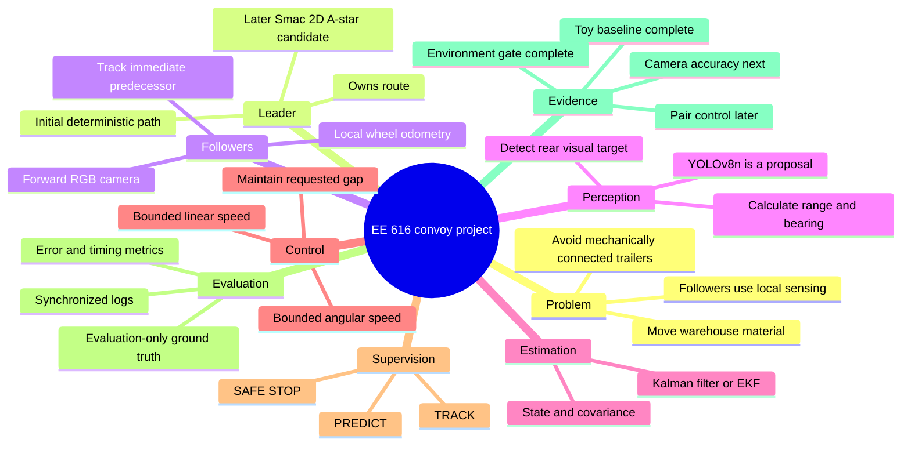
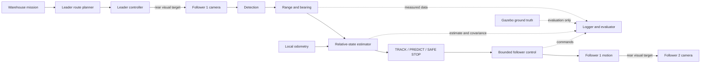
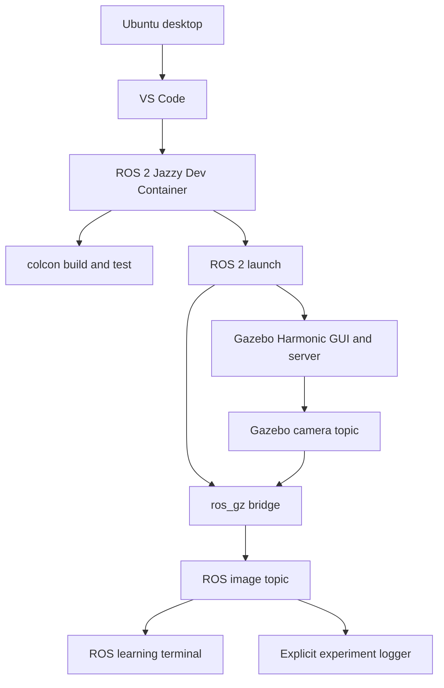
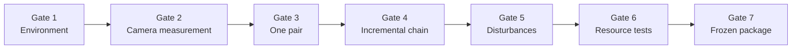

# Project Learning Maps

These maps are study aids. They show responsibility and evidence flow without claiming that planned components are already implemented.

## Project mind map

## Runtime responsibility map

The dotted ground-truth connection ends at the evaluator. It must never connect to detection, estimation, supervision, or control.

## Development-session map

## Evidence ladder

Each gate supports only the next bounded claim. A later demonstration cannot repair missing evidence from an earlier gate.
